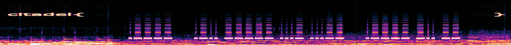
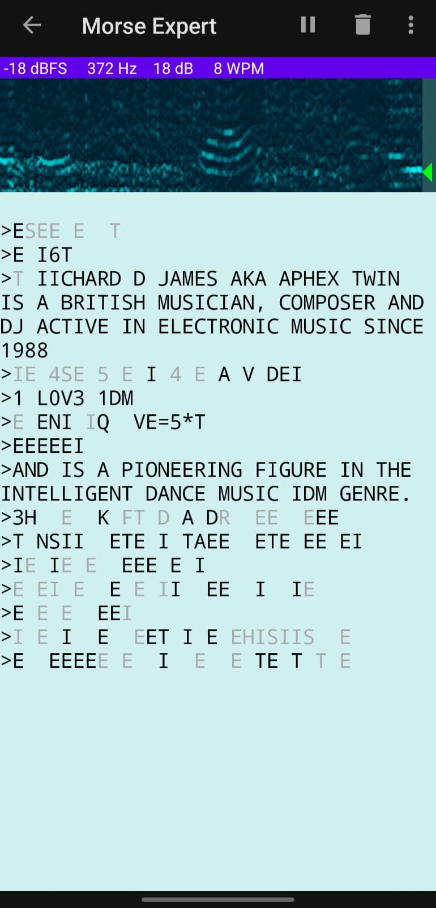

# Citadel

## 1. Zahard's Welcome

### Solution:
A invitation link to discord was given and a hint was given `The path begins in the gathering place`. Upon looking into the discord channel the flag was hidden in the rules channel of the discord.


## 2. The Social Network 

### Solution:
Here the start was to first search `citadweller` on instagram then there a post gave first half of the flag and that page to it's twitter page where I got the second half of the flag.


## 3. track 8

### Solution: 
The album's name was `Ginkgo` which was used as the key to decrypt  `twj eys zpr ukm 'viamnwqw' bx Izgo: esmqqui(yyr_oshwwcm_bwupa)` using Vigenère cypher and then got `now use the key 'panchiko' on Clag: rigckmv(osd_ikumqog_tjkjm)` which upon decrypting gave
the flag.


## 4. Omniscient Flag's Metadata

### Solution:
The challenge's name itself gave the hint that I should first check for metadata. On using `exiftool` on the given jpg file I found onr png file which contained the flag.


## 5. Test of Sweetness

### Solution:
A website link led to page where I realized that I can try going to cookies section and changing the `user` to `admin` and I got the flag.


## 6. Rotten Apple

### Solution:
The challenge's description said `The path forward is hidden in the distortion. Similar to how the album was warped, the password to the next floor has been warped first by a factor of 47, then by a factor of 13. Untangle these changes to reveal the code and continue your ascent` which gave a hint that the password was encoded with cipher (the challenge's name gave the hint that the cipher might be `ROT`) and also gave the two numbers in the order `47` then `13`. The word `Untangle` specificed that I had to do the reverse to decode the cipher.

### Website used: https://cryptii.com/pipes/rot13-decoder


## 7. Randomly Accessed Memory

### Solution:
I first opened the given git and started viewing random files hoping to find the flag but what I notices was that the text in those files did not make any sense and neither and any clue so it was clear that it is not there in any file and I also noticed that there were a large number of commits which was strange so I cloned the repo and looked into the commit history:
```bash
:~/daft-punk-archive# git log --oneline
168947c (HEAD -> main, origin/main, origin/HEAD) Routine update #300
778eece Routine update #299
6246c98 Routine update #298
726a3bf Routine update #297
f15c7e5 Routine update #296
589a485 Routine update #295
5bbbf2e Routine update #294
421e1ab Routine update #293
6cf2ca4 Routine update #292
7d22c4b Routine update #291
804adf1 Routine update #290
b788a15 Routine update #289
8f06b9a Routine update #288
f096064 Routine update #287
b5f3b1c Routine update #286
1cffc9e Routine update #285
2e3d91d Routine update #284
e252558 Routine update #283
451a2f9 Routine update #282
7e103ab Routine update #281
8d1aac6 Routine update #280
18f8435 Remove secret chunk 3 file (history-only)
79af115 Add secret chunk 3 (base64) [commit 279]
df7c6e6 Routine update #278
c2bc017 Routine update #277
f5fe582 Routine update #276
e50c0ac Routine update #275
2efae35 Routine update #274
7349c47 Routine update #273
```
Here the 3 secret chunk files was a big suspect so I saw whats was in there and found `dDBfZzF0X2x1Y2t5fQ==` using the command `git show 79af115` which seemed like a encoded text. I decoded it using `basee64` and got `t0_g1t_lucky}` now I was sure that flag might be splited into 3 chunks and stored so I search for the other 2 chunks-
```bash
~/daft-punk-archive# git log --oneline | grep "secret chunk"
18f8435 Remove secret chunk 3 file (history-only)
79af115 Add secret chunk 3 (base64) [commit 279]
977d650 Remove secret chunk 2 file (history-only)
cc8b79a Add secret chunk 2 (base64) [commit 122]
86fdefa Remove secret chunk 1 file (history-only)
50474f3 Add secret chunk 1 (base64) [commit 56]
```
Then I found out the remaining encoded texts and got `Y2l0YWRlbHt3M180cjM=` and `X3VwXzRsbF9uMXQzXw==` which on decoding separately gave the flag.

### Website used: https://www.base64decode.net/


## 8. Selected Ambient Work

### Solution:
As in the challenge description the hint `spectogram` gave the way that I used `audacity` to view the spectogram and got only

Now I had to decode the morse code. I searched alot for some automated tool because on typing the morse code and after decoding it I was not getting the right output. I could not find any website then I started looking into apps in play store and testing out a few apps I found one which gave me the content of the flag though I had to hold it near the speaker while playing the specific part of the audio which contained the flag.



## 9. The Robot's Trail 

### Solution: 
Here first I tried putting random extensions to the url to get something then after trying `/robots.txt` I got the a file which conatained hint to follow to different file like this I kept on  following the files `/etc/passwd → config.php → access.log → /proc/self/environ → secret dir → flag`.


## 10. Rotting in Deep

### Solution: 
Here I had to just reverse what was happening in the code-
```bash
out = "6895840967002953721051398351211751734500850509315790892845302801984496338433523326225010635779036738800318"
flag = ""
for i in out:
    flag+=str((int(i)-3)%10)

print(long_to_bytes(int(flag)))
```


## 11. Coco Conjecture

### Solution:
There was a pdf given which contained the maths to solve and number send by the server and then give the required answer. A program had to be used without hardcoded values to send answers to the server without any time outs.