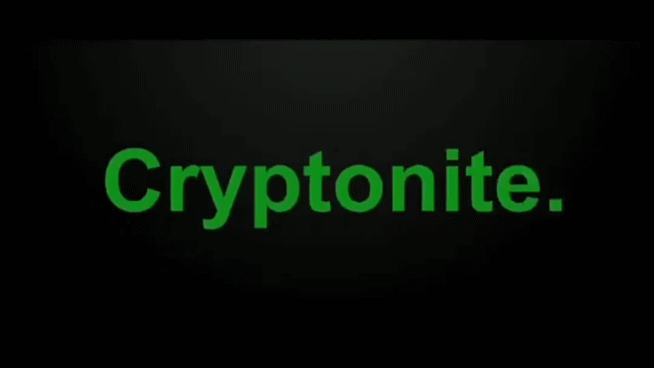

# **TASKPHASE-1(Linux Luminarium)**

### Day 1-10

- [**Hello Hackers**](./Linux_Luminarium/HELLO_HACKERS.md)
- [**Pondering Paths**](./Linux_Luminarium/Pondering_Paths.md)
- [**Comprehending Commands**](./Linux_Luminarium/Comprehending_Commands.md)
- [**Digesting Documentation**](./Linux_Luminarium/Digesting_Documentation.md)
- [**File Globbing**](./Linux_Luminarium/File_Globbing.md)
- [**Practicing Piping**](./Linux_Luminarium/Practicing_Piping.md)
- [**Shell Variables**](./Linux_Luminarium/Shell_Variables.md)
- [**Data Manipulate**](./Linux_Luminarium/Data_manipulation.md)
- [**Processes and Jobs**](./Linux_Luminarium/Processes_and_Jobs.md)
- [**Untangling Users**](./Linux_Luminarium/Untangling_Users.md)
- [**Perceiving Permissions**](./Linux_Luminarium/Perceiving_Permissions.md)
- [**Chaining Commands**](./Linux_Luminarium/Chaining_Commands.md)
- [**Terminal Multiplexing**](./Linux_Luminarium/Terminal_Multiplexing.md)
- [**Pondering PATH**](./Linux_Luminarium/Pondering_Path.md)

### **Extra-** [**Bandit**](./Bandit.md)